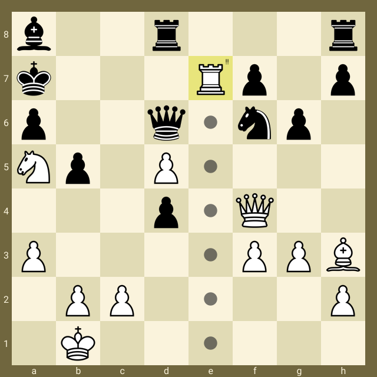
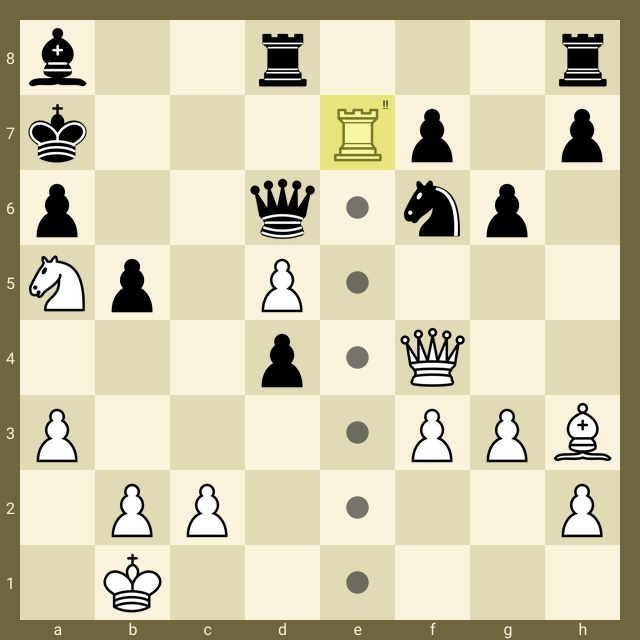

# ChessImager

## Table of Contents
1. [Description](#description)
2. [Example](#example)
4. [Settings](#settings)
1. [Render order](#render-order)
6. [Border renderer](#border-renderer)
7. [Board renderer](#board-renderer)
   1. [Board default](#board-default)
   2. [Board image](#board-image)

## Description

**ChessImager** is a **Go** package that creates images of chess boards based on a **FEN** string. It is highly 
configurable,
so that you can create chess board images that look exactly the way you want them to look. 

If you are happy with the default look, you can use that, but do note that the default embedded chess pieces are free for personal use only (See : https://clipart-library.com/clip-art/chess-pieces-silhouette-14.htm).

ChessImager is somewhat inspired by [CJSaylor](https://github.com/cjsaylor)'s repository 
[chessimage](https://github.com/cjsaylor/chessimage).

## Example:
Move 25 by **Kasparov**, playing against **Topalov** in **Wijk aan Zee** (**Netherlands**), 1999.



**Kasparov Garry** (RUS) vs. **Topalov Veselin** (BUL)

## Settings

ChessImager uses a configuration JSON file, to define the size of the board and colors etc. You can either use the 
embedded default.json or you can create your own configuration file. Read more about this below in


The default.json file contains settings for the render order, settings for each renderer, and also some extra style 
settings for the last four renderers. Let's go through all of these section, one by one!

## Context
The simplest way to use **ChessImager** is to use it in this way:
```go
const fen = "b2r3r/k3Rp1p/p2q1np1/Np1P4/3p1Q2/P4PPB/1PP4P/1K6 b - - 1 25"
image := chessImager.NewImager().Render(fen)
```
This will generate the image below, using the position in the **fen** string, and the 
settings in the embedded **default.json** file. 


If you want to do more advanced stuff, for example loading you own settings file, you can do that by creating a 
**chessImager.Context** object, like this:

```go
	ctx, _ := chessImager.NewContextFromPath("/home/me/mySettings.json")
```
or if you don't need to use your own JSON file, you could just do this: 
```go
	ctx, _ := chessImager.NewContext()
```
Once you have your context, you can add one or more **highlighted squares**, **moves**, or **annotations**  to the 
board. You can also change the rendering order using the **context** object, if your use case is more advanced.

Then, when you are ready to generate an image, you can call the **chessImager.Render()** method:
```go
imager := chessImager.NewImager()
const fen = "b2r3r/k3Rp1p/p2q1np1/Np1P4/3p1Q2/P4PPB/1PP4P/1K6 b - - 1 25"
ctx, _ := chessImager.NewContextFromPath("/home/me/mySettings.json")

// You can add moves, highlighted squares, annotations or change the render order here.

image := imager.RenderEx(fen,ctx)
```

## Render order
ChessImager is split up into seven different renderers, that are each responsible for drawing parts of
the chess board. The renderers, and their indexes, are:


| Index | Name               | Description                               |
|:-----:|:-------------------|:------------------------------------------|
|   0   | Border             | Renders the border around the chess board |
|   1   | Board              | Renders the rank numbers and file letters |
|   2   | RankAndFile        | Renders the chess board                   |
|   3   | HighlightedSquares | Renders the highlight squares             |
|   4   | Pieces             | Renders the chess pieces                  |
|   5   | Annotations        | Renders the annotation(s)                 |
|   6   | Moves              | Renders the move(s)                       |

You will not get very interesting images if you change the order of renderer 0 and 1. All the others can be moved 
around to fit your use case.

In the JSON file, you can set the order of the renderers by changing the **order** list. The default order
is the order above.  

| Name  | Type         | Description                         |
|-------|--------------|-------------------------------------|
| order | integer list | The digits 0 through 6 in any order |


An example would be if you want the pieces to be rendered **before** the highlighted squares, then you could set the 
order to be **0,1,2,4,3,5,6** by setting:
```json
{
   ...
  "order" : [0,1,2,4,3,5,6],
   ...
}

```
in the JSON file.

If you don't want to edit the JSON file, you could just specify it with code, like this:
```go
	_ = ctx.SetOrder([]int{0, 1, 2, 4, 3, 5, 6})
```

That would give you the following image:



Maybe not as pretty as the first example, but you have the option to change the order in case you need it.

Every new context created automatically loads the settings from the JSON file, so if you need a
different order for
your next image, then just create a new **context** object and work with that. In fact, creating a new context 
resets the
Moves, Annotations and Highlights lists, so it is generally a good idea to create a new context for each new image
that you want to generate.

## Border renderer
The border renderer is usually the first renderer. It clears the image with the Color specified in the JSON file, 
and therefore will remove everything else that has been rendered so far.

The settings for the border renderer can be found in the **border** section of the json file.

| Name  | Type    | Description                       |
|-------|---------|-----------------------------------|
| Width | integer | The width of the border in pixels |
| Color | string  | The color of the border           |

```json
{
   ...
   "border": {
      "width": 20,
      "color": "#70663EFF"
   },
   ...
}
```

## Board renderer
The board renderer is usually the second renderer. It has a type that specifies how the renderer should draw the board.

If type=0, then the renderer will draw the board manually using the settings in the **default** section (under the 
**board** section). 

If type=1 then the renderer will draw an image containing a chessboard using the settings in the **image** section (under the 
**board** section).

| Name    | Type    | Description                                   |
|---------|---------|-----------------------------------------------|
| type    | integer | 0 = default, 1 = image                        |
| default | -       | The settings for a manually drawn chess board |
| image   | -       | The settings for a chess board image          |


<mark>If you do use a board image, then the Border settings and RankAndFile settings will be ignored.</mark>

### Board default
The settings under **board.default** are the following:

| Name     | type    | Description                                                                     |
|----------|---------|---------------------------------------------------------------------------------|
| inverted | boolean | Black at the top, or white at the top.                                          |
| size     | integer | The size of the board (border not included). Should probably be dividable by 8. |
| white    | string  | The color for the white squares                                                 |
| black    | string  | The color for the black squares                                                 |


```JSON
  "board": {
    "type": 0,
    "default": {
        "inverted": false,
        "size": 600,
        "white": "#FAF3DCFF",
        "black": "#E1DBB5FF"
    }
}
```
### Board image

<mark>Not implemented yet</mark>

## Rank and File renderer
The rank and file renderer draws the letters A to H and the numbers 1 to 8 on the chess board.

| Name       | Type    | Description                                            |
|------------|---------|--------------------------------------------------------|
| type       | integer | 0 = none, 1 = in border, 2 = in squares                |
| font_color | string  | The color of the font for the rank and file indicators |
| font_size  | integer | The size of the font for the rank and file indicators  |

```JSON
  "rank_and_file": {
    "type": 1,
    "font_color": "#FAF3DCFF",
    "font_size":16
  }
```

## Highlight renderer
The highlight renderer highlights certain squares in whatever color you want. You can highlight the square by 
giving it a certain color, or a border of a certain color. You can also highlight the square by drawing a circle in 
the square, all depending on the Type field.

The style of the highlighted square is determined by the default highlight style provided in the `default.json` file.

| Name  | Type    | Description                                |
|-------|---------|--------------------------------------------|
| type  | integer | 0 = square, 1 = border, 2 = circle         |
| color | string  | The highlight color                        |
| width | integer | The width of the border or circle (type=2) |


You can add a highlighted square by using the method `AddHighlight()` on the **context** object:

```go
    ctx, _ := chessImager.NewContext()
    ctx.AddHighlight("e7")
    image := imager.RenderEx(fen, ctx)
```

Another alternative is to use the method `AddHighlightEx()`, that allows you to provide some special 
styling to this specific square:

```go
    ctx, _ := chessImager.NewContext()
    hs, _ := ctx.NewHighlightStyle(0, "#88008888", 0)
    ctx.AddHighlightEx("e7", hs)
    image := imager.RenderEx(fen, ctx)
```

## Piece renderer
The piece renderer are responsible for drawing the pieces on the board (as specified in the FEN string).

| Name      | Type    | Description                                                                                      |
|-----------|---------|--------------------------------------------------------------------------------------------------|
| factor    | float   | Resize factor for pieces where 1.0 is equal to 100%. Pieces will be scaled up or down the factor |
| type      | integer | 0 = Use embedded pieces, 1 = use 12 images, 2 = use an image map                                 |
| images    | -       | Contains 12 paths, one for each piece.                                                           |
| image_map | -       | Contains 1 path, and 12 rectangles.                                                              |

### Piece renderer - embedded pieces (type=0)

The embedded pieces has no configuration.

Example of the **pieces** section where type=0:

```JSON
  "pieces": {
    "factor" : 1.0,
    "type":0,
  },
```

### Piece renderer - images (type=1)

To use separate images for each piece you will have to provide 12 paths to the image files. The piece field must 
contain "wp","wb","wn","wr","wq" and "wk" for the white pieces, and "bp","bb","bn","br","bq" and "bk" for the black 
pieces 

Example of the **pieces** section where type=1:

```JSON
  "pieces": {
    "factor" : 1.0,
    "type":1,
    "images": {
        "pieces": [
            {"piece":"wp", "path":"/home/per/code/chessImager/test/data/wp.png"},
            {"piece":"wb", "path":"/home/per/code/chessImager/test/data/wb.png"},
            {"piece":"wn", "path":"/home/per/code/chessImager/test/data/wn.png"},
            {"piece":"wr", "path":"/home/per/code/chessImager/test/data/wr.png"},
            {"piece":"wq", "path":"/home/per/code/chessImager/test/data/wq.png"},
            {"piece":"wk", "path":"/home/per/code/chessImager/test/data/wk.png"},
            {"piece":"bp", "path":"/home/per/code/chessImager/test/data/bp.png"},
            {"piece":"bb", "path":"/home/per/code/chessImager/test/data/bb.png"},
            {"piece":"bn", "path":"/home/per/code/chessImager/test/data/bn.png"},
            {"piece":"br", "path":"/home/per/code/chessImager/test/data/br.png"},
            {"piece":"bq", "path":"/home/per/code/chessImager/test/data/bq.png"},
            {"piece":"bk", "path":"/home/per/code/chessImager/test/data/bk.png"}
        ]
    },
  },
```

### Piece renderer - image map (type=2)

To use an image map containing all 12 pieces, you will have to provide a path to the image, and 12 rectangle that 
specifies where in the image the pieces can be found.

This JSON will pick out the red and yellow pieces out of the following image.


```JSON
  "pieces": {
    "factor" : 1.0,
    "type": 2,
    "image_map": {
        "path": "/home/per/code/chessImager/test/data/pieces_colorful.png",
        "pieces": [
            {"piece":"WP","rect":{"x": 0,"y": 896,"width": 128,"height": 128}},
            {"piece":"WN","rect":{"x": 128,"y": 896,"width": 128,"height": 128}},
            {"piece":"WB","rect":{"x": 256,"y": 896,"width": 128,"height": 128}},
            {"piece":"WR","rect":{"x": 384,"y": 896,"width": 128,"height": 128}},
            {"piece":"WQ","rect":{"x": 512,"y": 896,"width": 128,"height": 128}},
            {"piece":"WK","rect":{"x": 640,"y": 896,"width": 128,"height": 128}},
            {"piece":"BP","rect":{"x": 0,"y": 640,"width": 128,"height": 128}},
            {"piece":"BN","rect":{"x": 128,"y": 640,"width": 128,"height": 128}},
            {"piece":"BB","rect":{"x": 256,"y": 640,"width": 128,"height": 128}},
            {"piece":"BR","rect":{"x": 384,"y": 640,"width": 128,"height": 128}},
            {"piece":"BQ","rect":{"x": 512,"y": 640,"width": 128,"height": 128}},
            {"piece":"BK","rect":{"x": 640,"y": 640,"width": 128,"height": 128}}
        ]
    }
  },
```
## Todo 

* Create a CLI tool?
* Highlighted square x:s : https://elzr.com/blag/img/2018/chess-pieces/chess-moves.png
* Fix BoardImage (not implemented yet)
* Fix Move (foundations implemented)
* rendererRankAndFile should use getSquareBox for RankAndFileInSquare
* in the readme.md file we are using WP and wp. Check if we handle capitalization of the piece tags.
* include simple example, advanced example, and SetOrder example
* embed default.json
* Validation of settings file? CHeck if font file exists, size out of square boundary, etc
* DX > DY (move renderer)
* Should settings not be a global var?
## Possible future todo:s
* Implement PGN : White player, Black player, move count etc
* Implement Possible Moves For/to square - show moves that a piece can do, or show pieces that can move to a square.
* Select corner for RankAndFileInSquare => RankAndFileTopLeft, RankAndFileTopRight, etc
