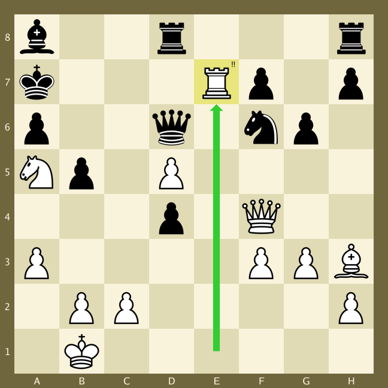

# ChessImager

**ChessImager** is a **Go** package that creates images of chess boards based on a **FEN** string. It is highly
configurable, so that you can create chess board images that look exactly the way you want them to look.

ChessImager is somewhat inspired by [CJSaylor](https://github.com/cjsaylor)'s repository [chessimage](https://github.com/cjsaylor/chessimage).

## Table of Contents

1. [Examples](#examples)
    1. [Simple](#simple)
    2. [Medium](#medium)
    3. [Advanced](#advanced)
    4. [Other](#other)
    5. [Castling](#castling)
2. [Configuration](#configuration)
    1. [Colors](#configuration---colors)
    2. [Fonts](#configuration---fonts)
3. [Context](#context)
4. [Render order](#render-order)
5. [Border renderer](#border-renderer)
6. [Board renderer](#board-renderer)
    1. [Board default](#board-default)
    2. [Board image](#board-image)
7. [Rank and file renderer](#rank-and-file-renderer)
8. [Highlight renderer](#highlight-renderer)
9. [Piece renderer](#piece-renderer)
    1. [Embedded pieces renderer](#piece-renderer---embedded-pieces-type0)
    2. [Images piece renderer](#piece-renderer---images-type1)
    3. [ImageMap piece renderer](#piece-renderer---image-map-type2)
10. [Annotations renderer](#annotations-renderer)
11. [Moves renderer](#moves-renderer)
    1. [Castling](#moves-renderer---castling)

## Examples:

All the examples below comes from move 25 by **Kasparov**, playing against **Topalov** in **Wijk aan Zee** (**Netherlands**), in 1999:

https://www.chess.com/games/view/969971

### Simple:

The first [example](examples/simple/simple.go) is super easy. Rendering a chess board image, based on a FEN string, is basically one line of code. Add a few more lines of code to
save the image to disk, and you have this code:

```go
   // Render simple image
   const fen = "b2r3r/k3Rp1p/p2q1np1/Np1P4/3p1Q2/P4PPB/1PP4P/1K6 b - - 1 25"
   img, _ := chessImager.NewImager().Render(fen)
   
   // Save image
   file, _ := os.Create("/path/to/img.png")
   defer fileSimple.Close()
   _ = png.Encode(file, img)
```

This code will generate the following image, using the default styling in [config/default.json](config/default.json):


### Medium:

Here is a slightly more [advanced example](examples/medium/medium.go), that adds a highlighted square, an annotation and a move. For this we need 
to create a [context](#context) object, using the `imager.NewContext()` method. We also need to use the `imager.RenderEx()` method 
so that we can add both the FEN string and [context](#context).

This example also uses the styles that are defined in the [config/default.json](config/default.json) files:

```go
   // Create a new imager using embedded default.json settings
   imager := chessImager.NewImager()
   
   // Create a new context
   ctx := imager.NewContext()
   
   // Highlight square e7, annotate square e7 with "!!" and
   // show move e1-e7 using the styles specified in default.json.
   ctx.AddHighlight("e7").AddAnnotation("e7", "!!").AddMove("e1", "e7")
   
   // Render image
   const fen = "b2r3r/k3Rp1p/p2q1np1/Np1P4/3p1Q2/P4PPB/1PP4P/1K6 b - - 1 25"
   image, _ := imager.RenderEx(fen, ctx)
```
This would generate the following image:



### Advanced:

Let's look at an even more [advanced example](examples/advanced/advanced.go). If you want to add annotations, highlighted squares and moves, using styles other than the ones provided in [config/default.json](config/default.json), you can do that by providing the styles objects manually.

For example, let's change a few things from the medium example:

* the highlight color and style (filled circle). See [Highlight renderer](#highlight-renderer) for more information.
* the annotation position (top left) and border color. See [Annotation renderer](#annotations-renderer) for more information.
* the move size and color for the next image. See [Move renderer](#moves-renderer) for more information.

And for fun, lets change the render order too...

Read more about renderers and their order in the [render order](#render-order) section.

```go
   // Create a new imager using embedded default.json settings
   imager := chessImager.NewImager()
   
   // Set the rendering order
   _ = imager.SetOrder([]int{0, 1, 2, 3, 5, 4, 6})
   
   // Create a new context
   ctx := imager.NewContext()
   
   // Create a highlight style, for the square e7
   hs, _ := ctx.NewHighlightStyle(
      chessImager.HighlightFilledCircle, // Highlight type 
      "#88E57C",                         // Highlight color
      4,                                 // Highlight cirle width
      0.9                                // Highlight factor (not used for this Type)        
   )
   
   // Create an annotation style, for the square e7
   as, _ := ctx.NewAnnotationStyle(
      chessImager.PositionTopLeft,       // Position top left
      25, 20, 1,                         // Size, font size, border width
      "#E8E57C", "#000000", "#FFFFFF",   // Background, font, border color
   )
   
   // Create a move style, for the move e1-e7 
   ms, _ := ctx.NewMoveStyle(
      chessImager.MoveTypeDots,           // Move type 
      "#9D6B5EFF",                        // Dot color
	  "#9D6B5EFF",                        // Dot color 2
      0.2,                                // Dot size
   )
   
   // Highlight the e7 square, annotate e7 as a brilliant move (!!) and
   // show move e1-e7.
   ctx.AddHighlightEx("e7", hs).AddAnnotationEx("e7", "!!", as).AddMoveEx("e1", "e7", ms)
   
   // Render the image 
   const fen = "b2r3r/k3Rp1p/p2q1np1/Np1P4/3p1Q2/P4PPB/1PP4P/1K6 b - - 1 25"
   image, _ := imager.RenderEx(fen, ctx)
```

This code will generate the following image:


As you can see, the pieces are now rendered **after** annotations, the annotation lies behind the piece.

### Other

In this [example](examples/other/other.go) we will create our own JSON file and load it using the `NewImagerFromPath()` function. In the 
[examples/other/other.json](examples/other/other.json) file, we will also use a board image, [examples/other/chessboard.jpg](examples/other/chessboard.jpg), instead of drawing it manually.

```go
	// Create a new imager using your custom JSON file
	imager, _ := chessImager.NewImagerFromPath("examples/other.json")

	// Highlight the e7 square, annotate e7 as a brilliant move (!!) and
	// show move e1-e7. 
	ctx := imager.NewContext().AddHighlight("e7").AddAnnotation("e7", "!!").AddMove("e1", "e7")

	// Render the image
	const fen = "b2r3r/k3Rp1p/p2q1np1/Np1P4/3p1Q2/P4PPB/1PP4P/1K6 b - - 1 25"
	img, _ := imager.RenderEx(fen, ctx)
```
This code will generate the following image:


Background chess board image comes from here : https://www.supercoloring.com/paper-crafts/printable-green-chess-board-with-pieces-template

### Castling

In this [example](examples/castling/castling.go) we will look at how to create castling moves. For more information about castling, check out the [castling section](#moves-renderer---castling).

```go
   // Create a new imager using embedded default.json settings
   imager := chessImager.NewImager()

   // Create a new context, and add white king side castling,
   // and black queen side castling.
   ctx := imager.NewContext().AddMove("0-0", "").AddMove("", "0-0-0")
   
   // Render the image
   const fen = "2kr4/8/8/8/8/8/8/5RK1 b - - 1 25"
   img, _ := imager.RenderEx(fen, ctx)
```
This code will generate the following image:


## Configuration

**ChessImager** uses a configuration JSON file to define the size of the board and colors etc. You can
either use the embedded [config/default.json](config/default.json) or you can create your own configuration file. If you want to use your own
configuration file, you will need to use the function `chessImager.NewImagerFromPath(path)`. See 
[examples/other/other.go](examples/other/other.go) for an example of how to do this.

### Configuration - colors

All colors in the settings file can be specified in one of four different ways, since the hashtag and the alpha values are optional:

| Pattern   | Example string |
|-----------|----------------|
| #RRGGBBAA | #10E4F3FF      |
| #RRGGBB   | #10E4F3        |
| RRGGBBAA  | 10E4F3FF       |
| RRGGBB    | 10E4F3         |

If you don't specify the alpha component of the color, FF will be assumed.

### Configuration - fonts
If no font is specified in the settings file, the Go Regular TTF font will be used.

The path must point to the TTF font file. Example:

```json
   "font_style": {
     "path" : "/home/[username]/roboto.ttf"
   }
```

## Context

For simple chess board images, you don't need a context. You can just use `chessImager.NewImager().Render(fen)` and
be done with it.

For more advanced chess board images, you will need to create a Context object, using the `chessImager.NewContext()`
function. Using this context object, you can add **highlighted squares**, **annotations** and **moves**.

Every new context created, resets the moves, annotations and highlighted squares lists, so it is strongly recommended
to create a new context for each new image that you want to generate. When you are ready to render the image, you 
pass along the context object to the `chessImager.RenderEx()` function.

## Render order

**ChessImager** is split up into seven different renderers, that are each responsible for rendering different parts of
the chess board. The renderers, and their indexes, are:

| Index | Name               | Description                               |
|:-----:|:-------------------|:------------------------------------------|
|   0   | Border             | Renders the border around the chess board |
|   1   | Board              | Renders the actual chess board            |
|   2   | RankAndFile        | Renders the rank numbers and file letters |
|   3   | HighlightedSquares | Renders the highlight squares             |
|   4   | Pieces             | Renders the chess pieces                  |
|   5   | Annotations        | Renders the annotations                   |
|   6   | Moves              | Renders the moves                         |

You will not get very interesting images if you change the order of renderer 0 and 1. But all renderers can be moved
around to fit your use case.

In the JSON file, you can set the order of the renderers by changing the **order** list. The default order
is the order above.

| Name  | Type         | Description                         |
|-------|--------------|-------------------------------------|
| order | integer list | The digits 0 through 6 in any order |

An example would be if you want the pieces to be rendered **before** the highlighted squares, then you could set the
order to be **0, 1, 2, 4, 3, 5, 6** by setting:

```json
{
  "order": [0, 1, 2, 4, 3, 5, 6],
}
```
in the JSON file.

If you don't want to edit the JSON file, you could just specify it with code, like this:
```go
    // Change rendering order to : 0, 1, 2, 4, 3, 5, 6 
    _ = imager.SetOrder([]int{0, 1, 2, 4, 3, 5, 6})
```
To reset the rendering order, you can either create a new ChessImager object, or just set the order to nil:
```go
    // Reset rendering order to default : 0, 1, 2, 3, 4, 5, 6
    _ = imager.SetOrder(nil)
```
Check out [examples/advanced/advanced.go](examples/advanced/advanced.go) to see how to change render order.
## Border renderer

The border renderer should always be the first renderer. It clears the image with the border color specified in the
JSON file, and therefore will remove everything else that has been rendered so far.

The settings for the border renderer can be found in the **border** section of the json file.

| Name  | Type    | Description                       |
|-------|---------|-----------------------------------|
| Width | integer | The width of the border in pixels |
| Color | string  | The color of the border           |

```json
{
  "border": {
    "width": 20,
    "color": "#70663EFF"
  },
}
```
The border settings will be ignored when `board.type=1` (image)

## Board renderer

The board renderer is usually the second renderer. It has a `type` field that specifies how the renderer should draw 
the board.

If `type`=0, then the renderer will draw the board manually using the settings in the [default](#board-default) section (under the **board** section).

If `type`=1 then the renderer will draw an image containing a chessboard using the settings in the [image](#board-image) section (under the **board** section). 

| Name    | Type    | Description                                   |
|---------|---------|-----------------------------------------------|
| type    | integer | 0 = default, 1 = image                        |
| default | -       | The settings for a manually drawn chess board |
| image   | -       | The settings for a chess board image          |

### Board default

The settings under **board.default** are the following:

| Name     | type    | Description                                                                     |
|----------|---------|---------------------------------------------------------------------------------|
| inverted | boolean | White at the bottom (false), or white at the top (true).                        |
| size     | integer | The size of the board (border not included). Should probably be divisible by 8. |
| white    | string  | The color for the white squares                                                 |
| black    | string  | The color for the black squares                                                 |

```JSON
   "board": {
      "type": 0,
      "default": {
         "inverted": false,
         "size": 600,
         "white": "#FAF3DCFF",
         "black": "#E1DBB5FF"
      }
   }
```

### Board image

You can use an image of a chess board as the background if you want to. 

Important : If you do use a board image, it is assumed that the border and rank and files are in the image, so the **border** settings and **rank and file** settings will be ignored.  

The settings under **board.image** are the following:

| Name     | type      | Description                                                 |
|----------|-----------|-------------------------------------------------------------|
| inverted | boolean   | Black at the top, or white at the top.                      |
| path     | string    | The path to the board image                                 |
| rect     | rectangle | A rectangle that specifies where in the image the board is. |

```JSON
   "board": {
      "type": 1,
      "image": {
         "inverted": false,
         "path": "/home/[username]/chessboard.png",
         "rect": {"x": 30, "y": 50, "width": 480,"height": 480},
      }
   }
```
See [examples/other/other.json](examples/other/other.json) for an example of how to use a background board image, instead of the default board.

## Rank and File renderer

The rank and file renderer renders the file letters A to H and the rank numbers 1 to 8 on the chess board.

| Name       | Type    | Description                                            |
|------------|---------|--------------------------------------------------------|
| type       | integer | 0 = none, 1 = in border, 2 = in squares                |
| font_color | string  | The color of the font for the rank and file indicators |
| font_size  | integer | The size of the font for the rank and file indicators  |

```JSON
   "rank_and_file": {
      "type": 1,
      "font_color": "#FAF3DCFF",
      "font_size": 16
   }
```
The rank and file settings will be ignored when `board.type=1` (image)

## Highlight renderer

The highlight renderer highlights certain squares in a number of different ways. For example, you can highlight the square filling it with a color, or giving it a border of a specific color.

The style of the highlighted square is normally determined by the default highlight style provided in the `default.
json` file.

| Name   | Type    | Description                                                      |
|--------|---------|------------------------------------------------------------------|
| type   | integer | 0 = square, 1 = border, 2 = circle, 3 = filled circle, 4 = cross |
| color  | string  | The highlight color                                              |
| width  | integer | The width of the border, circle or cross (type=1, 2 or 4)        |
| factor | float   | The size of the circle or cross (type=2, 3 or 4)                 |

The factor 0.5 means that the circle or cross should be 50% of the width of the square.

You can add a highlighted square by using the method `AddHighlight()` on the [context](#context) object in the style that is specified in the currently used JSON file:

```go
   imager := chessImager.NewImager()

   ctx := imager.NewContext()
   ctx.AddHighlight("e7")

   image := imager.RenderEx(fen, ctx)
```

Another alternative is to use the method `AddHighlightEx()`, that allows you to provide some special
styling to this specific square:

```go
   imager := chessImager.NewImager()
   
   ctx := imager.NewContext()
   hs, _ := ctx.NewHighlightStyle(0, "#88008888", 0, 0)
   ctx.AddHighlightEx("e7", hs)
   
   image := imager.RenderEx(fen, ctx)
```

## Piece renderer

The piece renderer are responsible for drawing the pieces on the board (as specified in the FEN string).

`type=0` means that you want to use the embedded pieces. See the [embedded pieces section](#piece-renderer---embedded-pieces-type0) for more information. This is the easiest option, but you should be aware that these images are for personal use only.

`type=1` means that you want to provide 12 images, one for each piece. See the [images section](#piece-renderer---images-type1) for more information.

`type=2` means that you want to provide an image map that contains all 12 pieces. See the [image map section](#piece-renderer---image-map-type2) for more information.

| Name      | Type    | Description                                                                                             |
|-----------|---------|---------------------------------------------------------------------------------------------------------|
| factor    | float   | Resize factor for pieces where 1.0 is equal to 100%. Pieces will be scaled up or down using the factor. |
| type      | integer | 0 = Use embedded pieces, 1 = use an image for each piece, 2 = use an image map                          |
| images    | -       | Contains 12 paths, one for each piece.                                                                  |
| image_map | -       | Contains 1 path, and 12 rectangles.                                                                     |

### Piece renderer - embedded pieces (type=0)

The embedded pieces has no configuration, except `piece.factor` that applies to all piece renderers.

Important :Note that the default embedded chess pieces are free for personal use only (See : https://clipart-library.com/clip-art/chess-pieces-silhouette-14.htm).

Example of the **pieces** section where type=0:

```JSON
   "pieces": {
      "factor": 1.0,
      "type": 0,
   },
```

### Piece renderer - images (type=1)

To use separate images for each piece you will have to provide 12 paths to the image files. The piece field must
contain "wp","wb","wn","wr","wq" and "wk" for the white pieces, and "bp","bb","bn","br","bq" and "bk" for the black
pieces

Example of the **pieces** section where type=1:

```JSON
   "pieces": {
      "factor": 1.0,
      "type": 1,
      "images": {
         "pieces": [
            {"piece": "wp", "path": "/home/per/code/chessImager/test/data/wp.png"},
            {"piece": "wb", "path": "/home/per/code/chessImager/test/data/wb.png"},
            {"piece": "wn", "path": "/home/per/code/chessImager/test/data/wn.png"},
            {"piece": "wr", "path": "/home/per/code/chessImager/test/data/wr.png"},
            {"piece": "wq", "path": "/home/per/code/chessImager/test/data/wq.png"},
            {"piece": "wk", "path": "/home/per/code/chessImager/test/data/wk.png"},
            {"piece": "bp", "path": "/home/per/code/chessImager/test/data/bp.png"},
            {"piece": "bb", "path": "/home/per/code/chessImager/test/data/bb.png"},
            {"piece": "bn", "path": "/home/per/code/chessImager/test/data/bn.png"},
            {"piece": "br", "path": "/home/per/code/chessImager/test/data/br.png"},
            {"piece": "bq", "path": "/home/per/code/chessImager/test/data/bq.png"},
            {"piece": "bk", "path": "/home/per/code/chessImager/test/data/bk.png"}
         ]
      },
   },
```

### Piece renderer - image map (type=2)

To use an image map containing all 12 pieces, you will have to provide a path to the image, and 12 rectangle that
specifies where in the image the pieces can be found.

This JSON will pick out the red and yellow pieces out of the following image.


https://opengameart.org/content/colorful-chess-pieces

```JSON
   "pieces": {
      "factor": 1.0,
      "type": 2,
      "image_map": {
         "path": "/home/per/code/chessImager/test/data/pieces_colorful.png",
         "pieces": [
            {"piece": "WP", "rect": {"x": 0, "y": 896, "width": 128,"height": 128}},
            {"piece": "WN", "rect": {"x": 128, "y": 896, "width": 128, "height": 128}},
            {"piece": "WB", "rect": {"x": 256, "y": 896, "width": 128, "height": 128}},
            {"piece": "WR", "rect": {"x": 384,"y": 896, "width": 128, "height": 128}},
            {"piece": "WQ", "rect": {"x": 512, "y": 896,"width": 128, "height": 128}},
            {"piece": "WK", "rect": {"x": 640, "y": 896, "width": 128,"height": 128}},
            {"piece": "BP", "rect": {"x": 0, "y": 640, "width": 128, "height": 128}},
            {"piece": "BN", "rect": {"x": 128, "y": 640, "width": 128, "height": 128}},
            {"piece": "BB", "rect": {"x": 256,"y": 640, "width": 128, "height": 128}},
            {"piece": "BR", "rect": {"x": 384, "y": 640,"width": 128, "height": 128}},
            {"piece": "BQ", "rect": {"x": 512, "y": 640, "width": 128,"height": 128}},
            {"piece": "BK", "rect": {"x": 640, "y": 640, "width": 128, "height": 128}}
         ]
      }
   },
```

## Annotations renderer

The annotation renderer is responsible for rendering annotations, like !! or ??. You decide how big the annotation
circle should be and what text it should contain.

The style of the annotation is normally determined by the default annotation style provided in the [config/default.json](config/default.json) file.

| Name             | Type    | Description                                                            |
|------------------|---------|------------------------------------------------------------------------|
| position         | integer | 0 = TopLeft, 1 = TopRight, 2 = BottomRight, 3 = BottomLeft, 4 = Middle |
| size             | integer | The size of the annotation circle                                      |
| font_color       | string  | The font color                                                         |
| font_size        | integer | The font size                                                          |
| background_color | string  | The background color of the annotation circle                          |
| border_color     | string  | The border color of the annotation circle                              |
| border_width     | integer | The width of the border                                                |

You can add an annotation by using the method `AddAnnotation()` on the [context](#context) object:

```go
   imager := chessImager.NewImager()

   ctx := imager.NewContext()
   ctx.AddAnnotation("e7", "!!")

   image, _ := imager.RenderEx(fen, ctx)
```

Another alternative is to use the method `AddAnnotationEx()`, that allows you to provide some special
styling to this specific square:

```go
   imager := chessImager.NewImager()
   ctx := imager.NewContext()
   as, _ := ctx.NewAnnotationStyle(
      chessImager.PositionTopLeft,
      25, 20, 1,
      "E8E57C", "000000", "FFFFFF",
   )
   ctx.AddAnnotationEx("e7", "11", as)
   image, _ := imager.RenderEx(fen, ctx)
```

## Moves renderer

The moves renderer is responsible for rendering moves, that is, indicating that a piece has moved from one square to another.

The style of the move can be changed in the [config/default.json](config/default.json) file (or your own version of 
that file), or by providing a `chessImager.MoveStyle` struct to the `AddMoveEx()` method.

| Name    | Type    | Description                                                                              |
|---------|---------|------------------------------------------------------------------------------------------|
| type    | integer | 0 = Dotted, 1 = Arrow                                                                    |
| color   | string  | The color of the dots or arrow                                                           |
| color2  | string  | The color of the second row of dots or arrow. Used only for castling moves.              |
| factor  | float   | The size of the dots or arrow, relative to the square size                               |
| padding | float   | How much space should there be between the arrow and the square border. Can be negative. |

You can add a move by using the method `AddMove()` on the [context](#context) object, by providing the from square and the to square.

```go
   imager := chessImager.NewImager()

   ctx := imager.NewContext()
   ctx.AddMove("e7", "c5")

   image, _ := imager.RenderEx(fen, ctx)
```

Another alternative is to use the method `AddMoveEx()`, that allows you to provide some special styling to this particular move, on top of the from square and the to square:

```go
   imager := chessImager.NewImager()
   ctx := imager.NewContext()
   
   // Create a move style, for the move e7-c5
   ms, _ := ctx.NewMoveStyle(
      chessImager.MoveTypeDots, // Move type
      "#9D6B5EFF",              // Dot color
      "#9D6B5EFF",              // Dot color 2
      0.2,                      // Dot size
   )
   ctx.AddMoveEx("e7", "c5", ms)
   
   image, _ := imager.RenderEx(fen, ctx)
```
### Moves renderer - Castling

To create a castling move, use one of the following eight variations:

```go
    // White king side castling
    ctx.AddMoveEx("0-0", "", ms) // or
    ctx.AddMoveEx("o-o", "", ms)

    // White queen side castling
    ctx.AddMoveEx("0-0-0", "", ms) // or
    ctx.AddMoveEx("o-o-o", "", ms)

    // Black king side castling
    ctx.AddMoveEx("", "0-0", ms) // or
    ctx.AddMoveEx("", "o-o", ms)

    // Black queen side castling
    ctx.AddMoveEx("", "0-0-0", ms) // or
    ctx.AddMoveEx("", "o-o-o", ms)
```

The color `movestyle.color` is used for the kings arrow or dots, and the color `movestyle.color2` is used for the rooks arrow or dots.

See the [castling example](examples/castling/castling.go) where the following image is generated: 


