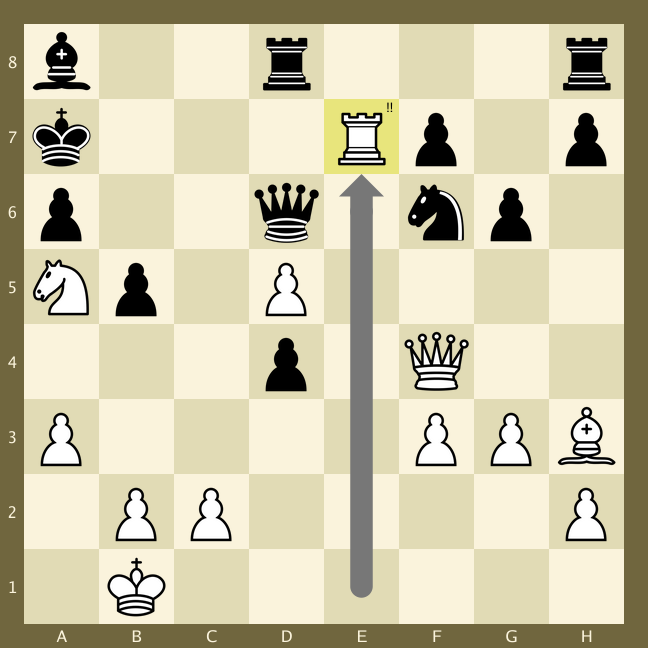

# ChessImager

**ChessImager** is a **Go** package that creates images of chess boards based on a **FEN** string. It is highly
configurable,
so that you can create chess board images that look exactly the way you want them to look.

If you are happy with the default look, you can use that, but do note that the default embedded chess pieces are free for personal use only (See : https://clipart-library.com/clip-art/chess-pieces-silhouette-14.htm).

ChessImager is somewhat inspired by [CJSaylor](https://github.com/cjsaylor)'s repository [chessimage](https://github.com/cjsaylor/chessimage).

## Table of Contents
1. [Example](#examples)
   1. [Simple](#simple)
   2. [Medium](#medium)
   3. [Advanced](#advanced)
2. [Settings](#settings)
   1. [Colors](#settings---colors)
3. [Render order](#render-order)
4. [Border renderer](#border-renderer)
5. [Board renderer](#board-renderer)
   1. [Board default](#board-default)
   2. [Board image](#board-image)
6. [Rank and file renderer](#rank-and-file-renderer)
7. [Highlight renderer](#highlight-renderer)
8. [Piece renderer](#piece-renderer)
   1. [Embedded pieces renderer](#piece-renderer---embedded-pieces-type0)
   2. [Images piece renderer](#piece-renderer---images-type1)
   3. [ImageMap piece renderer](#piece-renderer---image-map-type2)
9. [Annotations renderer](#annotations-renderer)
10. [Moves renderer](#moves-renderer)

## Examples:
### Simple:
Rendering a chess board image, based on a FEN string, is basically one line of code. Add a few more lines of code to 
save the image to disk, and you have this code:

```go
   // Render simple image
   const fen = "b2r3r/k3Rp1p/p2q1np1/Np1P4/3p1Q2/P4PPB/1PP4P/1K6 b - - 1 25"
   img, _ := chessImager.NewImager().Render(fen)
   
   // Save image
   file, _ := os.Create("/path/to/img.png")
   defer fileSimple.Close()
   _ = png.Encode(file, img)
```
This code will generate the following image, using the default styling in `default.json`:


### Medium:
A slightly more advanced example, that also uses the styles that are defined in the `default.json` files, would be:



```go
   // Create a new imager using embedded default.json settings
   imager := chessImager.NewImager()
   
   // Create a new context
   ctx := imager.NewContext()

   // Highlight square e7, annotate square e7 with "!!" and
   // show move e1-e7 using the styles specified in default.json.
   ctx.AddHighlight("e7").AddAnnotation("e7", "!!").AddMove("e1", "e7")
    
   // Render image
   const fen = "b2r3r/k3Rp1p/p2q1np1/Np1P4/3p1Q2/P4PPB/1PP4P/1K6 b - - 1 25"
   image, _ := imager.RenderEx(fen, ctx)
```
### Advanced:
If you want to add annotations, highlighted squares and moves, using styles other than the ones provided in default.
json, you can do that by either manually edit the default.json, or by providing the styles objects manually. 

For example, let's change a few things from the medium example:
* the highlight color and style (circle)
* the annotation position (top left) and border color 
* the move size and color for the next image
 
And for fun, lets change the render order too...

```go
   // Create a new imager using embedded default.json settings
   imager := chessImager.NewImager()
   
   // Set the rendering order
   imager.SetOrder([]int{0, 1, 2, 3, 5, 4, 6})
   
   // Create a new context
   ctx := imager.NewContext()

   // Create a highlight style, for the square e7
   hs, _ := ctx.NewHighlightStyle(
     chessImager.HighlightFull,          // Highlight type 
     "#88E57C",                          // Highlight color
     35,                                 // Highlight cirle radius
     0                                   // Highlight factor (not used for this Type)        
   )
   
   // Create an annotation style, for the square e7
   as, _ := ctx.NewAnnotationStyle(
     chessImager.PositionTopLeft,        // Position
     25, 20, 1,                          // Size, font size, border width
     "#E8E57C", "#000000", "#FFFFFF",    // Background, font, border color
   )
   
   // Create a move style, for the move e1-e7 
   ms, _ := ctx.NewMoveStyle(
     chessImager.MoveTypeDots,           // Move type 
     "#9D6B5EFF",                        // Dot color
     0.2,                                // Dot size
   )
     
   
   // Highlight the e7 square, annotate e7 as a brilliant move (!!) and
   // show move e1-e7.
   ctx.AddHighlightEx("e7", hs).AddAnnotationEx("e7", "!!", as).AddMoveEx("e1", "e7", ms)
   
   // Render the image 
   const fen = "b2r3r/k3Rp1p/p2q1np1/Np1P4/3p1Q2/P4PPB/1PP4P/1K6 b - - 1 25"
   image, _ := imager.RenderEx(fen, ctx)
```


As you can see, the pieces are now rendered **after** annotations, the annotation lies behind the piece.

All the examples above comes from move 25 by **Kasparov**, playing against **Topalov** in **Wijk aan Zee** (**Netherlands**), in 1999:

https://www.chess.com/games/view/969971

## Settings

ChessImager uses a configuration JSON file (default.json), to define the size of the board and colors etc. You can 
either use the embedded default.json or you can create your own configuration file. You can then load your config 
file by creating a new context by using the function NewContextFromPath(path).

The default.json file contains settings for the render order, settings for each renderer, and also some extra style 
settings to be used for annotations, highlighted squares and moves. Let's go through all of these section, one by one!

Every new context created, automatically loads the settings from either the embedded JSON file, or your own JSON file, 
so if you need a different order for your next image, then just create a new **context** object and work with that. 
In fact, creating a new context resets the Moves, Annotations and Highlights lists, so it is generally a good idea 
to create a new context for each new image that you want to generate.

### Settings - colors
All colors in the settings file can be specified in on of four different ways:
1. #RRGGBBAA - Example : #10E4F3FF
2. #RRGGBB - Example : #10E4F3
3. RRGGBBAA - Example : 10E4F3FF
4. RRGGBB - Example : 10E4F3
5. 
## Render order
ChessImager is split up into seven different renderers, that are each responsible for drawing different parts of
the chess board. The renderers, and their indexes, are:


| Index | Name               | Description                               |
|:-----:|:-------------------|:------------------------------------------|
|   0   | Border             | Renders the border around the chess board |
|   1   | Board              | Renders the actual chess board            |
|   2   | RankAndFile        | Renders the rank numbers and file letters |
|   3   | HighlightedSquares | Renders the highlight squares             |
|   4   | Pieces             | Renders the chess pieces                  |
|   5   | Annotations        | Renders the annotations                   |
|   6   | Moves              | Renders the moves                         |

You will not get very interesting images if you change the order of renderer 0 and 1. But all renderers can be moved 
around to fit your use case.

In the JSON file, you can set the order of the renderers by changing the **order** list. The default order
is the order above.  

| Name  | Type         | Description                         |
|-------|--------------|-------------------------------------|
| order | integer list | The digits 0 through 6 in any order |


An example would be if you want the pieces to be rendered **before** the highlighted squares, then you could set the 
order to be **0,1,2,4,3,5,6** by setting:
```json
{
   ...
  "order" : [0,1,2,4,3,5,6],
   ...
}

```
in the JSON file.

If you don't want to edit the JSON file, you could just specify it with code, like this:
```go
	imager.SetOrder([]int{0, 1, 2, 4, 3, 5, 6})
```

Each renderer has its own settings, which are described below.

## Border renderer
The border renderer should always be the first renderer. It clears the image with the border color specified in the 
JSON file, and therefore will remove everything else that has been rendered so far.

The settings for the border renderer can be found in the **border** section of the json file.

| Name  | Type    | Description                       |
|-------|---------|-----------------------------------|
| Width | integer | The width of the border in pixels |
| Color | string  | The color of the border           |

```json
{
   ...
   "border": {
      "width": 20,
      "color": "#70663EFF"
   },
   ...
}
```

## Board renderer
The board renderer is usually the second renderer. It has a type that specifies how the renderer should draw the board.

If type=0, then the renderer will draw the board manually using the settings in the **default** section (under the 
**board** section). For now this is the only board type that is implemented, so type should always be 0.

If type=1 then the renderer will draw an image containing a chessboard using the settings in the **image** section (under the 
**board** section). <mark>This type is not implemented yet.</mark>

| Name    | Type    | Description                                   |
|---------|---------|-----------------------------------------------|
| type    | integer | 0 = default, 1 = image                        |
| default | -       | The settings for a manually drawn chess board |
| image   | -       | The settings for a chess board image          |


<mark>If you do use a board image, then the Border settings and RankAndFile settings will be ignored.</mark>

### Board default
The settings under **board.default** are the following:

| Name     | type    | Description                                                                     |
|----------|---------|---------------------------------------------------------------------------------|
| inverted | boolean | Black at the top, or white at the top.                                          |
| size     | integer | The size of the board (border not included). Should probably be dividable by 8. |
| white    | string  | The color for the white squares                                                 |
| black    | string  | The color for the black squares                                                 |


```JSON
  "board": {
    "type": 0,
    "default": {
        "inverted": false,
        "size": 600,
        "white": "#FAF3DCFF",
        "black": "#E1DBB5FF"
    }
}
```
### Board image

<mark>Not implemented yet</mark>

## Rank and File renderer
The rank and file renderer draws the file letters A to H and the rank numbers 1 to 8 on the chess board.

| Name       | Type    | Description                                            |
|------------|---------|--------------------------------------------------------|
| type       | integer | 0 = none, 1 = in border, 2 = in squares                |
| font_color | string  | The color of the font for the rank and file indicators |
| font_size  | integer | The size of the font for the rank and file indicators  |

```JSON
  "rank_and_file": {
    "type": 1,
    "font_color": "#FAF3DCFF",
    "font_size":16
  }
```

## Highlight renderer
The highlight renderer highlights certain squares in whatever color you want. You can highlight the square by 
giving it a certain color, or a border of a certain color. You can also highlight the square by drawing a circle or 
a cross in the square, all depending on the type field.

The style of the highlighted square is normally determined by the default highlight style provided in the `default.
json` file.

| Name   | Type    | Description                                                      |
|--------|---------|------------------------------------------------------------------|
| type   | integer | 0 = square, 1 = border, 2 = circle, 3 = filled circle, 4 = cross |
| color  | string  | The highlight color                                              |
| width  | integer | The width of the border, circle or cross (type=1, 2 or 4)        |
| factor | float64 | The size of the circle or cross (type=2, 3 or 4)                 |

The factor 0.5 means that the circle or cross should be 50% och the width of the square.

You can add a highlighted square by using the method `AddHighlight()` on the **context** object:

```go
   imager := chessImager.NewImager()
   ctx := imager.NewContext()
   ctx.AddHighlight("e7")
   image := imager.RenderEx(fen, ctx)
```

Another alternative is to use the method `AddHighlightEx()`, that allows you to provide some special 
styling to this specific square:

```go
   imager := chessImager.NewImager()
   ctx := imager.NewContext()
   hs, _ := ctx.NewHighlightStyle(0, "#88008888", 0, 0)
   ctx.AddHighlightEx("e7", hs)
   image := imager.RenderEx(fen, ctx)
```

## Piece renderer
The piece renderer are responsible for drawing the pieces on the board (as specified in the FEN string).

| Name      | Type    | Description                                                                                      |
|-----------|---------|--------------------------------------------------------------------------------------------------|
| factor    | float   | Resize factor for pieces where 1.0 is equal to 100%. Pieces will be scaled up or down the factor |
| type      | integer | 0 = Use embedded pieces, 1 = use 12 images, 2 = use an image map                                 |
| images    | -       | Contains 12 paths, one for each piece.                                                           |
| image_map | -       | Contains 1 path, and 12 rectangles.                                                              |

### Piece renderer - embedded pieces (type=0)

The embedded pieces has no configuration, except `piece.factor` that applies to all piece renderers.

Example of the **pieces** section where type=0:

```JSON
  "pieces": {
    "factor" : 1.0,
    "type":0,
  },
```

### Piece renderer - images (type=1)

To use separate images for each piece you will have to provide 12 paths to the image files. The piece field must 
contain "wp","wb","wn","wr","wq" and "wk" for the white pieces, and "bp","bb","bn","br","bq" and "bk" for the black 
pieces 

Example of the **pieces** section where type=1:

```JSON
  "pieces": {
    "factor" : 1.0,
    "type":1,
    "images": {
        "pieces": [
            {"piece":"wp", "path":"/home/per/code/chessImager/test/data/wp.png"},
            {"piece":"wb", "path":"/home/per/code/chessImager/test/data/wb.png"},
            {"piece":"wn", "path":"/home/per/code/chessImager/test/data/wn.png"},
            {"piece":"wr", "path":"/home/per/code/chessImager/test/data/wr.png"},
            {"piece":"wq", "path":"/home/per/code/chessImager/test/data/wq.png"},
            {"piece":"wk", "path":"/home/per/code/chessImager/test/data/wk.png"},
            {"piece":"bp", "path":"/home/per/code/chessImager/test/data/bp.png"},
            {"piece":"bb", "path":"/home/per/code/chessImager/test/data/bb.png"},
            {"piece":"bn", "path":"/home/per/code/chessImager/test/data/bn.png"},
            {"piece":"br", "path":"/home/per/code/chessImager/test/data/br.png"},
            {"piece":"bq", "path":"/home/per/code/chessImager/test/data/bq.png"},
            {"piece":"bk", "path":"/home/per/code/chessImager/test/data/bk.png"}
        ]
    },
  },
```

### Piece renderer - image map (type=2)

To use an image map containing all 12 pieces, you will have to provide a path to the image, and 12 rectangle that 
specifies where in the image the pieces can be found.

This JSON will pick out the red and yellow pieces out of the following image.


```JSON
  "pieces": {
    "factor" : 1.0,
    "type": 2,
    "image_map": {
        "path": "/home/per/code/chessImager/test/data/pieces_colorful.png",
        "pieces": [
            {"piece":"WP","rect":{"x": 0,"y": 896,"width": 128,"height": 128}},
            {"piece":"WN","rect":{"x": 128,"y": 896,"width": 128,"height": 128}},
            {"piece":"WB","rect":{"x": 256,"y": 896,"width": 128,"height": 128}},
            {"piece":"WR","rect":{"x": 384,"y": 896,"width": 128,"height": 128}},
            {"piece":"WQ","rect":{"x": 512,"y": 896,"width": 128,"height": 128}},
            {"piece":"WK","rect":{"x": 640,"y": 896,"width": 128,"height": 128}},
            {"piece":"BP","rect":{"x": 0,"y": 640,"width": 128,"height": 128}},
            {"piece":"BN","rect":{"x": 128,"y": 640,"width": 128,"height": 128}},
            {"piece":"BB","rect":{"x": 256,"y": 640,"width": 128,"height": 128}},
            {"piece":"BR","rect":{"x": 384,"y": 640,"width": 128,"height": 128}},
            {"piece":"BQ","rect":{"x": 512,"y": 640,"width": 128,"height": 128}},
            {"piece":"BK","rect":{"x": 640,"y": 640,"width": 128,"height": 128}}
        ]
    }
  },
```
## Annotations renderer
The annotation renderer is responsible for rendering annotations, like !! or ??. You decide how big the annotation 
circle should be and what text it should contain.

The style of the annotation is normally determined by the default annotation style provided in the `default.
json` file.

| Name             | Type    | Description                                                            |
|------------------|---------|------------------------------------------------------------------------|
| position         | integer | 0 = TopLeft, 1 = TopRight, 2 = BottomRight, 3 = BottomLeft, 4 = Middle |
| size             | integer | The size of the annotation circle                                      |
| font_color       | string  | The font color                                                         |
| font_size        | integer | The font size                                                          |
| background_color | string  | The background color of the annotation circle                          |
| border_color     | string  | The border color of the annotation circle                              |
| border_width     | integer | The width of the border                                                |

You can add an annotation by using the method `AddAnnotation()` on the **context** object:

```go
   imager := chessImager.NewImager()
   ctx := imager.NewContext()
   ctx.AddAnnotation("e7", "!!")
   image, _ := imager.RenderEx(fen, ctx)
```

Another alternative is to use the method `AddAnnotationEx()`, that allows you to provide some special
styling to this specific square:

```go
   imager := chessImager.NewImager()
   ctx := imager.NewContext()
   as, _ := ctx.NewAnnotationStyle(
      chessImager.PositionTopLeft,
      25, 20, 1,
      "E8E57C", "000000", "FFFFFF",
   )
   ctx.AddAnnotationEx("e7", "11", as)
   image, _ := imager.RenderEx(fen, ctx)
```

## Moves renderer

## Todo 

* Tests
* Implement BoardImage
* Implement MoveTypeArrows
* rendererRankAndFile should use getSquareBox for RankAndFileInSquare
* in the readme.md file we are using WP and wp. Check if we handle capitalization of the piece tags.
* Select corner for RankAndFileInSquare => RankAndFileTopLeft, RankAndFileTopRight, etc
* Remove panics
